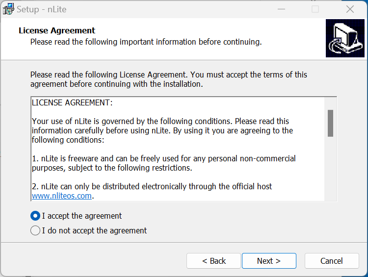
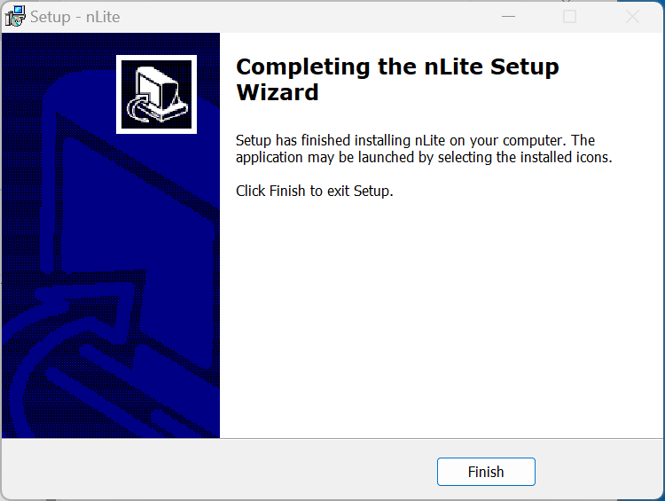

# Integration

Windows XP lacks network drivers and therefore most of the driver detection tools never worked on Windows XP even when it was a supported Operating System. On Business models such as an OptiPlex, Latitude or Precision it is easier to slipstream a driver pack opposed to installing the system drivers manually via USB. Many of these Business Models came with Windows Vista Business or Windows 7 Professional Licenses and used OEM Downgrade Rights to Windows XP Professional and their hardware is more capable than earlier Windows XP Devices.

## Windows XP Installation Media

Most Dell Devices which came with Windows XP OEM shipped with a Dell Windows Reinstallation CD/DVD. The Windows XP Reinstallation CD/DVD applies Dell OEM System Locked Preinstallation activating on a Dell Device when the BIOS has a System License Internal Code of 1.0, 2.0 (Windows Vista Business Downgrade Rights) or 2.1 (Windows 7 Professional Downgrade Rights). Insert it into your optical drive:


<details>
  <summary>Unofficial Links (Untested)</summary>

Unofficially a copy of the Dell Windows XP Reinstallation ISO appears to be listed here:

* [Archive Org Dell Windows XP SP3 Professional Reinstallation ISO](https://archive.org/details/dell.-xp-pro-sp-3)
* [Archive Org Dell Windows XP SP2 Home Reinstallation ISO](https://archive.org/details/dell-xp-home-sp-2)
* [Archive Org Dell Windows XP SP2 Media Center Reinstallation ISO](https://archive.org/details/xp-mce-sp-2)

Mount the ISO. A modern Windows Version has the capability of mounting an ISO natively. Windows XP does not have this capability and in order to mount an ISO in Windows XP itself [Virtual CloneDrive](https://www.elby.ch/en/products/vcd.html) is required.

</details>

## Windows XP Service Pack 3

If your Installation Media is not at Service Pack 3 and is not the Media Center Edition\*, you should slipstream Windows XP Service Pack 3. It can be downloaded from:

* [Windows XP Service Pack 3](https://www.majorgeeks.com/files/details/microsoft_Windows_xp_service_pack_3.html)

\* Slipstreaming Service Pack 3 into the Media Center Edition breaks Windows Media Center.

Note slipstream of the Unofficial Service Pack 4 is not recommended because it breaks the OEM SLP which will result in Windows XP Activation Issues.

## Windows XP Component Updates

Internet Explorer 8 could be slipstreamed with nlite but required IE8 in the form of a CAB file. I am unable to find the CAB file, just the EXE which cannot be slipstreamed. IE8 should therefore be installed manually post-installation of Windows XP:

* [Internet Explorer 8](https://www.majorgeeks.com/files/details/microsoft_internet_explorer_8_for_xp.html)

Windows Media Player 11 could be slipstreamed with nlite but required an addon which seems to no longer be available. WMP11 should therefore be installed manually post-installation of Windows XP:

**Check if Windows XP Version**

* [Windows Media Player 11](https://www.majorgeeks.com/files/details/windows_media_player.html)

## Downloading the Dell Driver Pack

All Windows XP Devices, including the Devices that used OEM Downgrade Rights are end of life models. Navigate to [Dell Drivers and Downloads](https://www.dell.com/support/home/en-uk?app=drivers) and search for the Device Model:


Under Operating System select Windows XP for a WinXP Driver CAB Pack:


Download this file, it contains all the drivers required for slipstream:


Once downloaded the file needs to be extracted:


Right click the Start Button and select Terminal:


To extract the `.CAB` file input:

```
expand -F:* Downloads\7010-xp-A05-K0CK5.CAB \Downloads
```

Replacing `Downloads\7010-xp-A05-K0CK5.CAB` with the path to your `.CAB` file.

To extract the CAB file on Windows XP [7zip](https://7-zip.org/download.html) is required.


The `.CAB` file will be extracted, close the Windows Terminal:


The extracted folder indicates the model number:


The operating system `xp`:


The architecture `x86`:


Subfolders are available for each category of driver:


## Windows XP Folder

In Downloads. Create a new folder called `win_xp`:


Open up the Windows XP Reinstallation CD/DVD in Windows Explorer:


Copy its contents:


To the `win_xp` folder:


It should look like the following:


## nLite

nLite can be downloaded from:

* [nLite](https://www.nliteos.com/download.html)

Launch the setup:


Select `OK`:


Select Next:


Accept the License Agreement and select Next:



Select Next:


Select Next:


Select Next:


Select Finish:



## Service Pack and Driver Integration

Launch nLite and select Next:


Select the `win_xp` folder:


Select Next:


If your Installation Media is not at Service Pack 3 and is not the Media Center Edition\*, you should slipstream Windows XP Service Pack 3. Select select:


Select Yes:


Select OK and slipstream XP Service Pack 3 KB936929:


The Service Pack level should now be Service Pack 3. Select Next:


Select Insert:


Navigate to the x86 folder:


Select All:


Select OK:


The next screen will ask what Storage Controller Driver to Slipstream, this should the SATA Operation used in the BIOS Setup. On the OptiPlex 7010.Select only one of the drivers:

* If installing Windows XP using the RAID SATA Operation in the BIOS Setup use the Intel Desktop/Workstation/Server Express Chipset SATA RAID Controller.
* If installing Windows XP using the AHCI SATA Operation in the BIOS Setup use the Intel ICH10R SATA AHCI Controller **(recommended)**.

Select Next:


Select Next:


Select Yes to proceed with the driver integration:


Select Next:


Change the Label to `WinXPOpt7010` where `Opt7010` is an abbreviated model number and select Make ISO:


Save the ISO in downloads as `WindowsXPProSP3OptiPlex7010` indicating the edition and model:


Select Next:


Select Finish:


## Creating Installation Media

To create installation media, either Burn to DVD or Create a Bootable USB. To create a DVD right click the ISO, select Show More Options and Burn Disc Image.

To create a Bootable USB two utilities will be used:

* [Rufus](https://rufus.ie/en/)
* [WinSetupFromUSB](https://winsetupfromusb.org/downloads/)

\* The last version that will work on Windows XP is 2.18. There is often issues creating a Bootable USB for Windows XP using Rufus because of the way the USB is partitioned, when the Windows XP reboots, the USB Drive is recognised as C:\ and the Windows setup cannot files which it expects on C:\ but are on D:\, the WinSetupFrom USB doesn't have this issue but often has issues formatting a multi-partition USB. So Rufus will be sued to partition the USB. Insert a 4-16 GB USB Flash Drive and launch Rufus: 


Under Boot selection, select Non-Bootable, under file system select NTFS. Select Start:


Select OK:


Close Rufus:


Launch WinSetupFromUSB (use the 32 Bit Version on Windows XP):


Select the USB Flash Drive and then select Windows 2000/XP/2003 Setup and select the `win_xp` folder (alternatively mount the ISO and select the mounted Drive). Select Go:


Accept the License Agreement:


The Bootable USB is created. Select Ok and Exit:


Return to [Windows XP Installation](../readme.md).
