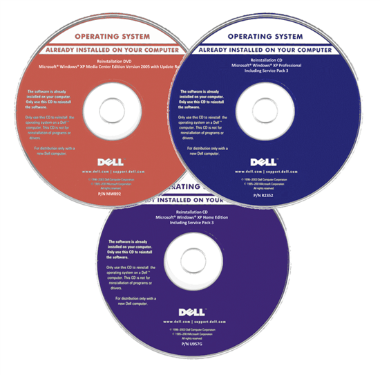
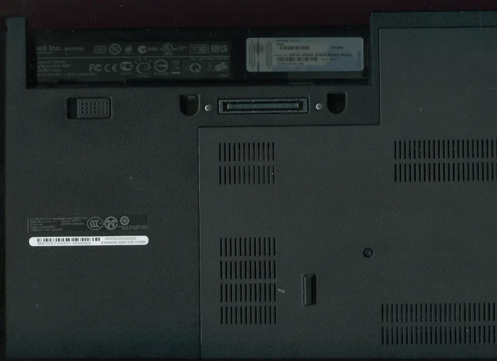
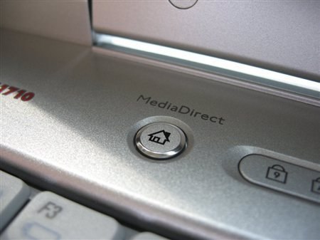
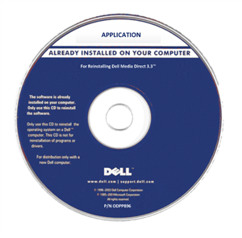

# Windows XP Reinstallation Guide

## Dell Windows XP Reinstallation CD/DVD

Most Dell Windows XP Systems shipped with a Dell Windows Reinstallation CD/DVD:

Windows XP Systems came with a Code of Authenticity but this wasn't typically used as Windows XP OEM activated using OEM System Locked Preinstallation. In OEM System Locked Preinstallation, the Dell Device has a System License Internal Code of 1.0 embedded in the Devices BIOS. Instead of the OEM Product Key on the CoA, a generic System Locked Preinstallation key is used. When the SLP key is used in conjunction with a Dell Device with a SLIC 1.0, automatic offline Product Activation Occurs:

  
Unofficial Links (Untested)

Unofficially a copy of the Dell Windows XP Reinstallation ISO appears to be listed here:

* [Archive Org Dell Windows XP SP3 Professional Reinstallation ISO](https://archive.org/details/dell.-xp-pro-sp-3)
* [Archive Org Dell Windows XP SP2 Home Reinstallation ISO](https://archive.org/details/dell-xp-home-sp-2)
* [Archive Org Dell Windows XP SP2 Media Center Reinstallation ISO](https://archive.org/details/xp-mce-sp-2)

For best results use a CD/DVD.

It is recommended to integrate Service Pack 3 (unless the edition is Media Center as Service Pack 3 integration breaks Media Center) and the systems driver cabinet using nLite as this will make Windows XP Installation on hardware much smoother. For more details see [Service Pack and Driver Integration using nLite](./integration/readme.md).

## Dell Media Direct DVD

Dell Media Direct was a Windows application for Media Playback configured for a handful of 2006-2007 Inspiron, Latitude and XPS models. Dell also included a second power button which allowed Media Direct to boot from a preboot environment allowing Media Direct to be used outwith Windows. Ignore this section if your Dell Device does not have a Media Direct button:

For correct operation the preboot environment needs to be setup before Windows by booting from the DVD and setting up the partitions and the application needs to be installed after Windows XP and the Windows XP system drivers:

**Failure to setup up Media Direct properly on these models often resulted in Booting Issues when the Media Direct Button was pressed.**

  
Unofficial Links (Untested)

For Inspiron 640M, 6400/E1505, 9400/E1705, XPS M1210, XPS M1710, XPS M2010:

* [Media Direct 3.3 ISO](https://archive.org/details/dell-media-direct-3.3)

For Inspiron 1420, 1520, 1720, 6400, XPS M1210
M1330, Latitude D620 and Latitude D630:

* [Dell Media Direct 3.3](https://archive.org/details/media-direct-restore)

For Vostro 1400, 1500, 1700:

For Inspiron 1525, XPS M1330, M1530, M1730 and Latitude D830:

* [Dell Media Direct 3.5](https://archive.org/details/DellMediaDirect3.5ReinstallDVDForInspiron)

## 

