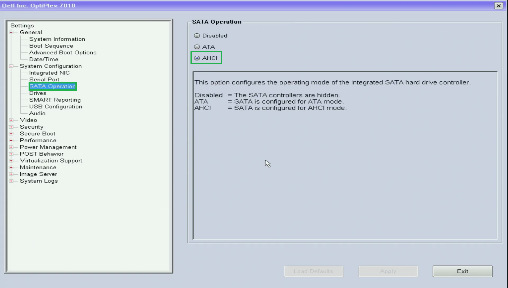
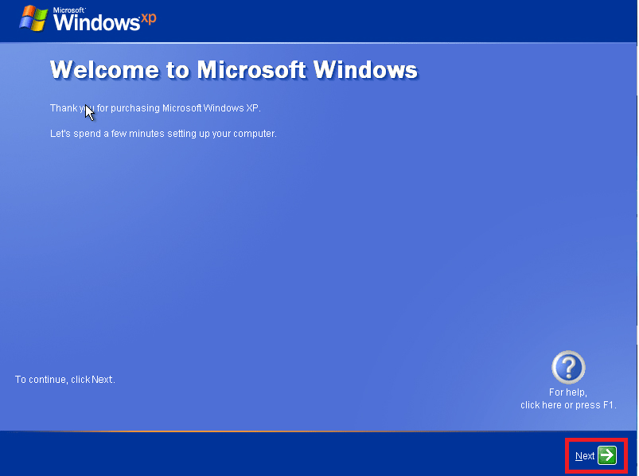
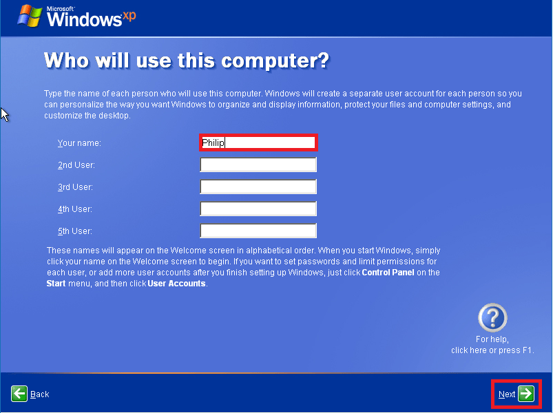

# Windows XP Reinstallation Guide

Before attempting to install Windows XP on your end of life Dell model, confer with the [Dell Drivers and Downloads](https://www.dell.com/support/home/en-uk?app=drivers) to check if there is a Windows XP driver set. The last Dell Desktop to support Windows XP Professional via OEM Downgrade Rights from Windows 7 Professional is the OptiPlex 7010 which has a Intel Q77 Express Chipset (3rd Generation Intel Processors). Intel did not provide drivers for the Intel Q87 Express Chipset (4th Generation Intel Processors).

## Dell Windows XP Reinstallation CD/DVD

Most Dell Windows XP Devices shipped with a Dell Windows Reinstallation CD/DVD:

Windows XP Devices shipped with Windows XP came with a Windows XP Code of Authenticity (CoA). Newer Dell Business Devices came with a Windows Vista Business CoA or Windows 7 Professional CoA. The Product Key affixed to the CoA wasn't typically used as Windows XP OEM activated using OEM System Locked Preinstallation (SLP). In OEM SLP, the Dell Device has a System License Internal Code (SLIC) of 1.0 embedded in the Devices BIOS. Instead of the OEM Product Key on the CoA, a generic SLP key is used. When the SLP key is used in conjunction with a Dell Device with a SLIC 1.0, automatic offline Product Activation occurs:

  
Unofficial Links (Untested)

Unofficially a copy of the Dell Windows XP Reinstallation ISO appears to be listed here:

* [Archive Org Dell Windows XP SP3 Professional Reinstallation ISO](https://archive.org/details/dell.-xp-pro-sp-3)
* [Archive Org Dell Windows XP SP2 Home Reinstallation ISO](https://archive.org/details/dell-xp-home-sp-2)
* [Archive Org Dell Windows XP SP2 Media Center Reinstallation ISO](https://archive.org/details/xp-mce-sp-2)

For best results use a CD/DVD.

It is recommended to integrate Service Pack 3 and the systems driver cabinet using nLite as this will make Windows XP Installation on hardware much smoother. For more details see [Service Pack and Driver Integration using nLite](./integration/readme.md).

## Dell Media Direct DVD

Dell Media Direct was a Windows application for Media Playback configured for selected 2006-2007 Inspiron, Latitude and XPS laptop models. Dell also included a second power button which allowed Media Direct to boot from a preboot environment allowing Media Direct to be used outwith Windows. Ignore this section if your Dell Device does not have a Media Direct button:

For correct operation the preboot environment needs to be setup before Windows by booting from the DVD and setting up the partitions and the application needs to be installed after Windows XP and the Windows XP system drivers:

**Failure to setup up Media Direct properly on these models often resulted in Booting Issues when the Media Direct Button was pressed.**

  
Unofficial Links (Untested)

For Inspiron 640M, 6400/E1505, 9400/E1705, XPS M1210, XPS M1710, XPS M2010:

* [Media Direct 3.3 ISO](https://archive.org/details/dell-media-direct-3.3)

For Inspiron 1420, 1520, 1720, 6400, XPS M1210
M1330, Latitude D620 and Latitude D630:

* [Dell Media Direct 3.3](https://archive.org/details/media-direct-restore)

For Vostro 1400, 1500, 1700:

* Dell Media Direct (No Download)

For Inspiron 1525, XPS M1330, M1530, M1730 and Latitude D830:

* [Dell Media Direct 3.5](https://archive.org/details/DellMediaDirect3.5ReinstallDVDForInspiron)

The Media Direct ISO images don't boot properly from USB so burn the image to a DVD.

## BIOS Setup

Power up the Dell and press `F2` to get to the Dell BIOS Setup:

Most Dell XP Devices that supported Windows XP had a Legacy BIOS. However the later Dell Windows 7 Devices that supported Windows XP via downgrade rights had a UEFI BIOS. Windows XP does not support UEFI or Secure Boot: 

Select Secure Boot:

Change from Enabled to Disabled:

In Advanced Boot Options, enable Legacy Option ROMs:

In System Configuration, the SATA Operation can be selected. For Windows XP use AHCI:

## Setup Media Direct Partition

  
Media Direct

## Installation

