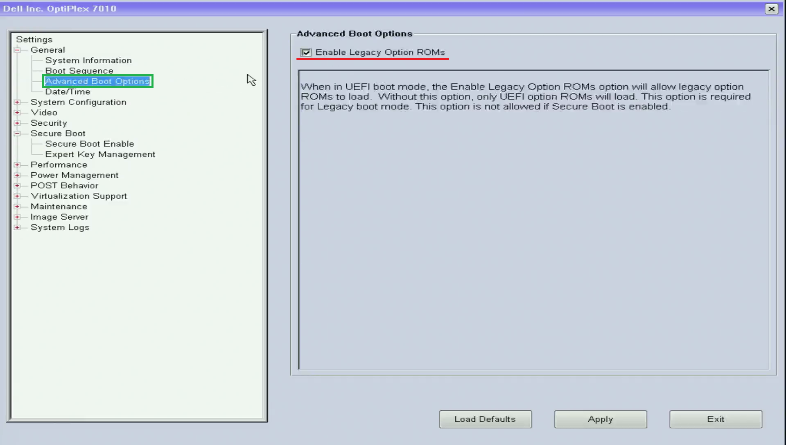
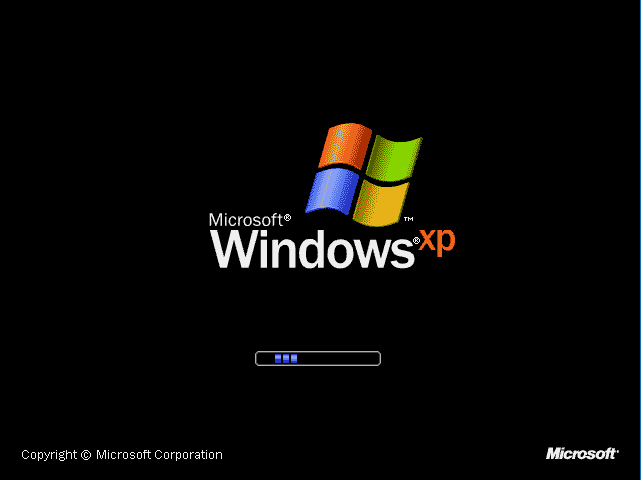
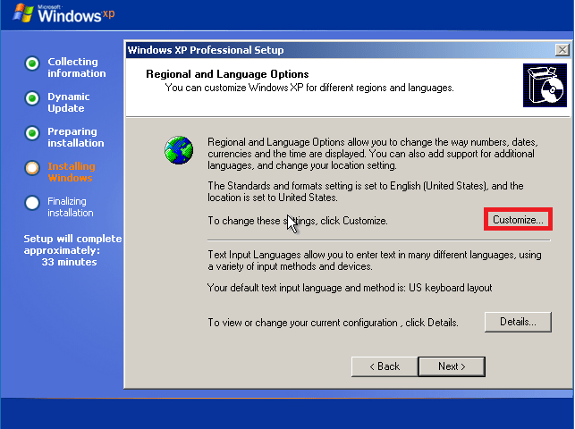
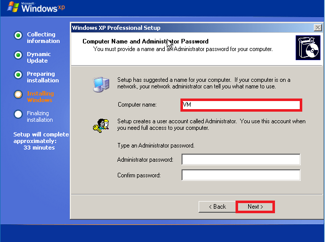

# Windows XP Reinstallation Guide

## Windows XP Code of Authencity

Dell systems which shipped with Windows XP typically had either: 

* Windows XP Home/Pro/MCE CoA
* Windows Vista Business CoA (OEM Downgrade Rights to Windows XP Pro)
* Windows 7 Professional CoA (OEM Downgrade Rights to Windows XP Pro)

CoAs were prone to fading making the product key unreadible. Fortunately the 25 digit product key was not required as an Offline BIOS based Product Activation known as Dell OEM System Locked Preinstallation was used.

## Supported Systems

OEM Downgrade rights were typically only on the business range of products for example the OptiPlex Desktops and Latitude Laptops. The last systems to support Windows XP had a 3rd Generation intel Processors. On these last models, UEFI was introduced as an enterprise feature for Windows 7 and Secure Boot was introduced as an enterprise feature for Windows 8. These features are not supported by Windows XP and have to be disabled:

|Model|Release Date|Processor|SLIC|Technologies|
|---|---|---|---|---|
|OptiPlex 755|2008|Intel Core 2 Duo|2.0|Legacy BIOS|
|OptiPlex 760|2009|Pentium|2.1|Legacy BIOS|
|OptiPlex 780|2010|Core 2 Quad|2.1|Legacy BIOS|
|OptiPlex 390/790|2011|2nd Generation (Sandy Bridge)|2.1|UEFI BIOS – No Secure Boot, there is no option for Legacy ROMs as these are always Enabled|
|OptiPlex 3010/7010|2012|3rd Generation (Ivy Bridge)|2.1|UEFI BIOS with Secure Boot (only with the latest UEFI BIOS Update)|
|~~OptiPlex 7020~~|2014|~~4th Generation (Haswell)~~|2.1|UEFI BIOS with Secure Boot|
|~~OptiPlex 7040~~|2015|~~6th Generation (Skylake)~~|2.1|UEFI BIOS with Secure Boot|
|~~OptiPlex 7050~~|2017|~~6th Generation (Skylake) or 7th Generation (Kabylake)~~|2.1|UEFI BIOS with Secure Boot|
|~~OptiPlex 7060~~|2018|~~8th generation (Coffeelake)~~|2.1|UEFI BIOS with Secure Boot|

|Model|Release Date|Processor|SLIC|Technologies|
|---|---|---|---|---|
|Latitude Exx0x|2008|Intel Core Duo|2.0|Legacy BIOS|
|Latitude Exx1x|2010|1st Gen|2.1|UEFI BIOS – No Secure Boot (only with the latest UEFI BIOS Update), there is no option for Legacy ROMs as these are always Enabled|
|Latitude Exx2x|2010|2nd Gen|2.1|UEFI BIOS – No Secure Boot, there is no option for Legacy ROMs as these are always Enabled|
|Latitude Exx3x|2011|3rd Gen|2.1|UEFI BIOS – No Secure Boot, there is no option for Legacy ROMs as these are always Enabled|
|~~Latitude Exx4x~~|2013|~~4th Generation (Haswell)~~|2.1|UEFI BIOS with Secure Boot|
|~~Latitude Exx5x~~|2015|~~5th Generation (Broadwell)~~|2.1|UEFI BIOS with Secure Boot|
|~~Latitude Exx8x~~|2017|~~6th Generation (Skylake)~~|2.1|UEFI BIOS with Secure Boot|
|~~Latitude Exx9x~~|2018|~~8th Generation (Coffeelake)~~|2.1|UEFI BIOS with Secure Boot|

## Dell Windows XP Reinstallation CD/DVD

Most Dell Windows XP Devices shipped with a Dell Windows Reinstallation CD/DVD which applied OEM System Locked Preinstallation:

  
Unofficial Links (Untested)

Unofficially a copy of the Dell Windows XP Reinstallation ISO appears to be listed here:

* [Archive Org Dell Windows XP SP3 Professional Reinstallation ISO](https://archive.org/details/dell.-xp-pro-sp-3)
* [Archive Org Dell Windows XP SP2 Home Reinstallation ISO](https://archive.org/details/dell-xp-home-sp-2)
* [Archive Org Dell Windows XP SP2 Media Center Reinstallation ISO](https://archive.org/details/xp-mce-sp-2)

### Slipstream

It is recommended to integrate Service Pack 3 and the systems driver cabinet using nLite as this will make Windows XP Installation on hardware much smoother. For more details see [Service Pack and Driver Integration using nLite](./integration/readme.md). Note Service pack 3 cannot be integrated with Windows XP Media Centre as integration of the Service Pack breaks the setup of Media Centre. Be careful when integrating the Service Pack not to break OEM SLP.

### CD/DVD

For best results burn the Windows XP ISO to a CD/DVD. 

### USB

Rufus did not work properly with Windows XP Installation Media. During the Windows Setup the USB flash drive was recognised as `X:` but after reboot it is recognised as `D:` meaning that the Windows setup can't find a file from the installation media during the Windows setup. Redirecting the installation media to that file only find that file and does not change the directory to search for the next file, meaning there are 200-300 prompts...

WinSetupFromUSB creates a bootloader and USB folder mapping that mimics a CD/DVD. This works from Windows XP Home and Windows XP Pro but usually breaks the Media Centre Edition file structure meaning Windows XP Media Centre Edition is installed without Media Centre.

## OEM System Locked Preinstallation

The Dell BIOS has a System Licence Internal Code 1.0 (SLIC 1.0 included with SLIC 2.1 or SLIC 2.0 via downgrade rights). Dell Windows XP Reinstalaltion Media uses a generic System locked Preinstallation Key. When the SLP key is used in conjunction with the SLIC 1.0 in the Dell BIOS, automatic offline Product Activation occurs.

## Dell Media Direct DVD

Dell Media Direct was a Windows application for Media Playback configured for selected 2006-2007 Inspiron, Latitude and XPS laptop models. Dell also included a second power button which allowed Media Direct to boot from a preboot environment allowing Media Direct to be used outwith Windows. Ignore this section if your Dell Device does not have a Media Direct button:

For correct operation the preboot environment needs to be setup before Windows by booting from the DVD and setting up the partitions and the application needs to be installed after Windows XP and the Windows XP system drivers:

**Failure to setup up Media Direct properly on these models often resulted in Booting Issues when the Media Direct Button was pressed.**

  
Unofficial Links (Untested)

For Inspiron 640M, 6400/E1505, 9400/E1705, XPS M1210, XPS M1710, XPS M2010:

* [Dell Media Direct 3.3 ISO](https://archive.org/details/dell-media-direct-3.3)

For Inspiron 1420, 1520, 1720, 6400, XPS M1210
M1330, Latitude D620 and Latitude D630:

* [Dell Media Direct 3.3 ISO](https://archive.org/details/media-direct-restore)

For Vostro 1400, 1500, 1700:

* Dell Media Direct (No Download)

For Inspiron 1525, XPS M1330, M1530, M1730 and Latitude D830:

* [Dell Media Direct 3.5 ISO](https://archive.org/details/DellMediaDirect3.5ReinstallDVDForInspiron)

The Media Direct ISO images don't boot properly from USB so burn the image to a DVD.

## BIOS Setup

Power up the Dell and press `F2` to get to the Dell BIOS Setup:

Most Dell XP Devices that supported Windows XP had a Legacy BIOS. However the later Dell Windows 7 Devices that supported Windows XP via downgrade rights had a UEFI BIOS. Windows XP does not support UEFI or Secure Boot: 

Select Secure Boot:

Change from Enabled to Disabled:

In Advanced Boot Options, enable Legacy Option ROMs:

In System Configuration, the SATA Operation can be selected. For Windows XP use AHCI:

## Setup Media Direct Partition

Skip this section unless your system came with Dell Media Direct.

  
Media Direct

To get to the BIOS Boot Menu hold F12 while powering up your computer (at the Dell BIOS splash screen): 

Press the `↓` key and highlight CD/DVD drive and press `↵`:

Press `h` to boot from the CD/DVD:

The MediaDirect preinstallation setup will then load. Type in `y`:

Type in a `h`:

During the Windows XP Setup, no partitions should be changed. Press the `↓` key to get to `C:\` and highlight CD/DVD drive and press `↵`. Press `↵` to install:

Press `↵` to install:

## Installation

To get to the BIOS Boot Menu hold F12 while powering up your computer (at the Dell BIOS splash screen): 

Press the `↓` key and highlight CD/DVD drive and press `↵`:

Press `h` to boot from the CD/DVD:

To setup Windows XP press `↵`:

Press `F8` to accept the License Agreement:

For a system that has been partitioned using the Dell Media Direct CD/DVD. Press the `↓` key to get to `C:\` and highlight CD/DVD drive and press `↵`. Press `↵` to install:

For a system that has not been partitioned using the Dell Media Direct CD/DVD, select each partition and press `D` to delete. Delete all partions until it says unpartitioned space and press `↵` to install:

Press the `↓` key and select Format the Partition using the NTFS File System and press `↵` to proceed:

The Windows XP setup will reboot:

In the next screen you will be given the language settings. Select Customise:

In the Regional options tab under Standards and Formats select the Language (Regional Language Settings) and under Location select the Location, then select Apply. In this example the options are set for English (UK):

The English (US) keyboard is selected by default. To change this select Details:

In this example, English (UK) will be selected:

Select next:

Input the Computer Name and select Next:

Use the default settings for the Workgroup and seelct Next:

Select the Time Zone and then select Next:

Select Typical Settings and then select Next:

Select OK:

Select OK:

The Windows XP Logo will display:

Select Next:

Select Not right now and select Next:

Select skip:

Input your user name and select next:

Select Finish:

You will be now taken to the Windows XP Desktop:

## Additional Setup Screens – Windows XP Media Center Edition

For Windows XP Media Centre Edition there will be a few additional steps. It will automatically reboot and then install the Media Centre Edition programs, you shouldn't touch your computer at this point. It should then reboot and you should be taken to the Windows Desktop.

## Product Key and Product Activation

A Dell Windows XP Reinstallation CD/DVD should automatically input a Dell System Locked Preinstallation Key and this alongside the System License Internal Code 1.0 embedded in the Dell BIOS should lead to offline Product Activation.

## System Drivers

**For Windows XP to function correctly (particularly system audio), Dell Drivers should be installed in the following order:**

* Dell System (Notebook/Desktop) Software – Under System Utilities
* Chipset Drivers – Intel Chipset First – Under Chipset
* Chipset Drivers – Any other Intel – Under Chipset
* Card Reader – Realtek, Ricoh, O2 Micro – Under Chipset or Removable Storage
* Intel Matrix Storage Manager/Rapid Storage Technology – Under SATA Drives or CPU
* Video\* – Intel, AMD or NVIDIA – Under Video
* Modem\* – Conexant or Intel – Under Modem
* Network\* – Ethernet – Under Network
* Touchpad – Touchpad – Under Input
* Audio – Sigmatel, Intel or Realtek – Under Audio
* TVTuners – Under Video
* Wireless Card\* – Under Network
* Bluetooth\* – Under Network
* Keyboard/Mouse Application – Under Applications
* Dell Quickset – Under Applications
* Webcam Driver – Under Input

The drivers marked with \* typically have variants. Install the driver first and then any application. Note if you select the wrong variant the driver will fail to install.

Not all these drivers are available for all Models, Touchpads were only prevalent in laptops and not every model had a wireless card or bluetooth. TV tuners were quite rare.

Unfortunately for Windows XP, the system drivers were not listed in the correct installation order. When downloading the drivers it is recommended to create folder names corresponding to the above list, so you know what driver is what.

Dell System Drivers can be downloaded from:

* [Dell Drivers and Downloads](https://www.dell.com/support/home/en-uk?app=drivers&msockid=2093e6dfeda16022171cf2a7ec996136)

Note all Windows XP systems are listed under the Legacy category (or under the product name and then Legacy).

## Royal and Royal Noir Theme

* [Royale and Royale Noir Theme](https://istartedsomething.com/20061029/royale-noir/#downloadlink)

