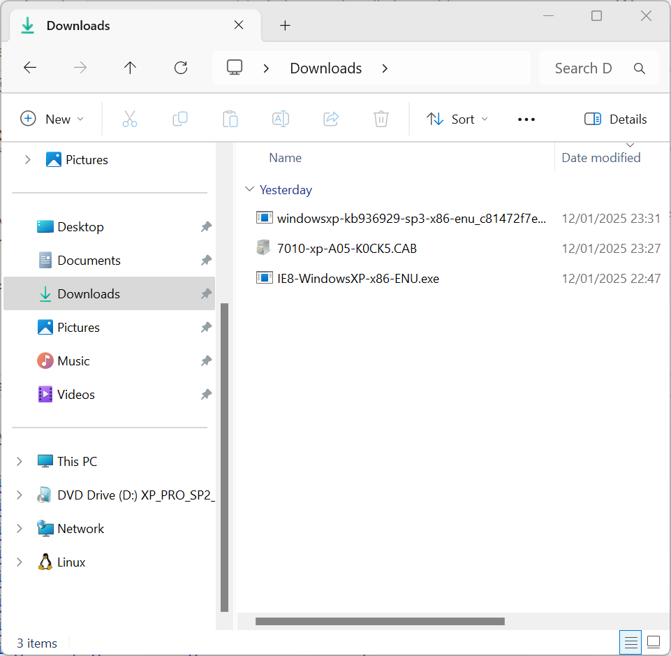
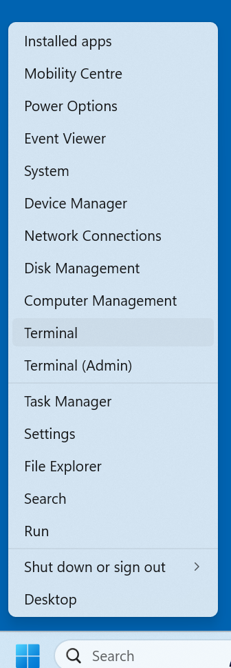
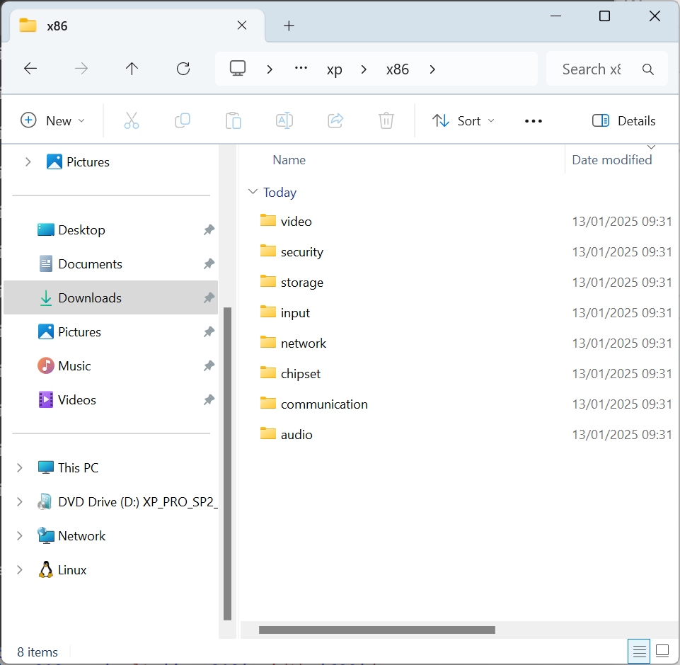
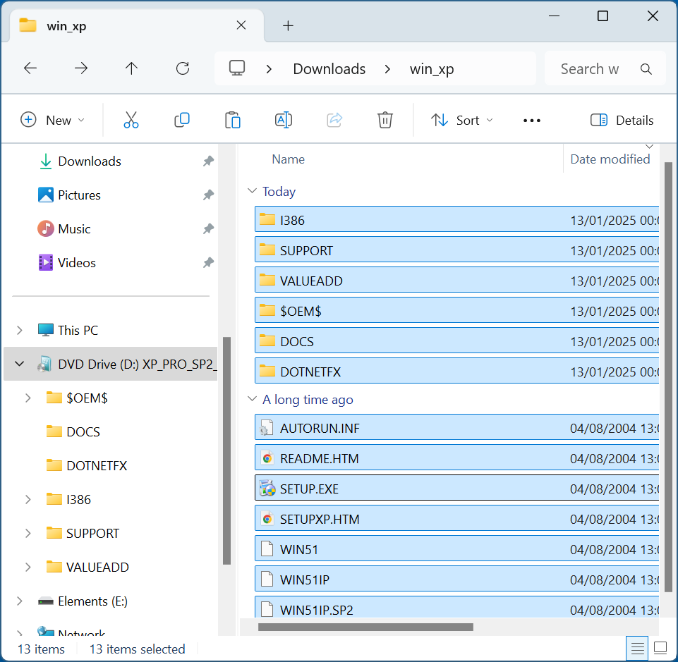
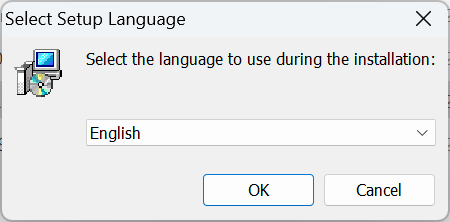

# Slipstreaming

Windows XP lacks network drivers and therefore most of the driver detection tools never worked on Windows XP even when it was a supported Operating System. On Business models such as an OptiPlex, Latitude or Precision it is easier to slipstream a driver pack opposed to installing the system drivers manually via USB. Many of these Business Models came with Windows Vista Business or Windows 7 Professional Licenses and used OEM Downgrade Rights to Windows XP Professional and their hardware is more capable than earlier Windows XP Devices.

## Windows XP Installation Media

Most Dell Devices which came with Windows XP OEM shipped with a Dell Windows Reinstallation CD/DVD. The Windows XP Reinstallation CD/DVD applies Dell OEM System Locked Preinstallation activating on a Dell Device when the BIOS has a System License Internal Code of 1.0, 2.0 (Windows Vista Business Downgrade Rights) or 2.1 (Windows 7 Professional Downgrade Rights). Insert it into your optical drive:


<details>
  <summary>Unofficial Links (Untested)</summary>

Unofficially a copy of the Dell Windows XP Reinstallation ISO appears to be listed here:

* [Archive Org Dell Windows XP SP3 Professional Reinstallation ISO](https://archive.org/details/dell.-xp-pro-sp-3)
* [Archive Org Dell Windows XP SP2 Home Reinstallation ISO](https://archive.org/details/dell-xp-home-sp-2)
* [Archive Org Dell Windows XP SP2 Media Center Reinstallation ISO](https://archive.org/details/xp-mce-sp-2)

Mount the ISO. A modern Windows Version has the capability of mounting an ISO natively. Windows XP does not have this capability and in order to mount an ISO in Windows XP itself [Virtual CloneDrive](https://www.elby.ch/en/products/vcd.html) is required.

</details>

## Windows XP Service Pack 3

If your Installation Media is not at Service Pack 3 and is not the Media Center Edition\*, you should slipstream Windows XP Service Pack 3. It can be downloaded from:

* [Windows XP Service Pack 3](https://www.majorgeeks.com/files/details/microsoft_Windows_xp_service_pack_3.html)

\* Slipstreaming Service Pack 3 into the Media Center Edition breaks Windows Media Center.

Note slipstream of the Unofficial Service Pack 4 is not recommended because it breaks the OEM SLP which will result in Windows XP Activation Issues.

## Windows XP Component Updates

Internet Explorer 8 could be slipstreamed with nlite but required IE8 in the form of a CAB file. I am unable to find the CAB file, just the EXE which cannot be slipstreamed. IE8 should therefore be installed manually post-installation of Windows XP:

* [Internet Explorer 8](https://www.majorgeeks.com/files/details/microsoft_internet_explorer_8_for_xp.html)

Windows Media Player 11 could be slipstreamed with nlite but required an addon which seems to no longer be available. WMP11 should therefore be installed manually post-installation of Windows XP:

**Check if Windows XP Version**

* [Windows Media Player 11](https://www.majorgeeks.com/files/details/windows_media_player.html)

## Downloading the Dell Driver Pack

All Windows XP Devices, including the Devices that used OEM Downgrade Rights are end of life models. Navigate to [Dell Drivers and Downloads](https://www.dell.com/support/home/en-uk?app=drivers) and search for the Device Model:


Under Operating System select Windows XP for a WinXP Driver CAB Pack:


Download this file, it contains all the drivers required for slipstream:


Once downloaded the file needs to be extracted:



Right click the Start Button and select Terminal:



To extract the `.CAB` file input:

```
expand -F:* Downloads\7010-xp-A05-K0CK5.CAB \Downloads
```

Replacing `Downloads\7010-xp-A05-K0CK5.CAB` with the path to your `.CAB` file.

To extract the CAB file on Windows XP [7zip](https://7-zip.org/download.html) is required.


The `.CAB` file will be extracted, close the Windows Terminal:


The extracted folder indicates the model number:


The operating system `xp`:


The architecture `x86`:


Subfolders are available for each category of driver:



## Windows XP Folder

In Downloads. Create a new folder called `win_xp`:


Open up the Windows XP Reinstallation CD/DVD in Windows Explorer:


Copy its contents:


To the `win_xp` folder:


It should look like the following:



## nLite

nLite can be downloaded from:

* [nLite](https://www.nliteos.com/download.html)

Launch the setup:


Select `OK`:



Select Next:


Accept the License Agreement and select Next:


Select Next:


Select Next:


Select Next:


Select Finish:


## Slipstreaming

Launch nLite and select Next:


Select the `win_xp` folder:


If the BIOS is set to AHCI:
Select the driver for 7M (usually named something like iaAHCI.inf in the extracted driver pack).
If the BIOS is set to RAID:
Select the driver for 7R (usually named something like iaStor.inf in the extracted driver pack).

https://winsetupfromusb.org/


## Slipstreaming Updates and SATA Drivers with nLite

Note nLite will only work properly with Windows XP Home and Windows XP Professional. Windows XP Media Centre is a kind of modified version of Windows XP professional with Service Pack 2. Slipstream of the Service Pack and Windows XP Updates will break the Media Centre functionality of the Windows XP Media Centre Edition DVD.

You may skip this step if your Reinstallation CD/DVD is Media Centre or is already up to date.

Install nlite and install the Windows Media Player 11 slipstreamer. Ensure that the install location for the Media Player slipstreamer is in the nlite directory; most likely “C:\Program Files\nLite”:

* nlite (1.4.9.1)
* Windows Media Player 11 Slipstreamer
* Windows Media Player 11
* 7zip (likely the 32 bit .msi unless you have a 64 bit OS)

Download the standalone service packs and save these on your desktop; if your disc includes these Service Packs (it will generally save if it has a service pack on the CD) you don't need to download them:

* Service Pack 2 (x86) (select language)
* Service Pack 3 (x86) (select language)

There is an unofficial Service Pack 4 Service Pack which includes all post updates up until April the 8th 2014. I have attempted slipstream with nLite but it breaks the BIOS Embedded SLP key on the Dell OEM Reinstallation CD/DVD.

Download the following to your desktop:

* ProgramAddons Internet Explorer 8.0
* Intel F6Flpy-x86 SATA drivers

Note if you cannot get the Intel SATA Drivers than search for Intel Matrix Storage Manager on the Intel Download Centre and select Windows XP as the OS. This will cover most Dell systems (which have an Intel Chipset). If you get stuck on this ask in the Disk Drive Forums for best advice.

Right click your .iso on the Windows Desktop and select Extract to

Go to the start menu and load nLite. If you are using a Windows Vista or later computer to do this accept the UAC prompt.

In the locating Windows Installation select your “XP” folder. Then click next and next again.

Select the service pack then click next.

Slipstream the SP2 and then the SP3 if not already present. Click next and if it says "do you want to start the process" select yes and then select finish.

Open nlite again, select your Windows XP installation again.

This time select "Hotfixes, Add-ons and Update Packs" and "Drivers" (if you want to slipstream SATA drivers). Also select "Tweaks".

Select insert and select the Windows Media Player 11 file. Then select insert again and select the ProgramAddons Internet Explorer 8.0 file.

Click next (if you selected drivers you will get this)

At this stage you may slipstream the likes of SATA drivers.

The Intel SATA drivers will be downloaded in a .zip format, these should be extracted with 7zip. Right click the folder and select 7zip > extract to "f6flpy-x86".


Right click the file with 7zip and click Extract to 'folder'. The contents of the extracted folder should look like this.

Note if there is a similar folder with an x64 i.e. in this case f6flpy-x64 these are the 64 bit drivers. You don't need the 64 bit drivers, delete this folder. Once you have this extracted folder click Insert

Select Multiple Driver folder.


Select All and then select OK

Again select All

To do this select the top one and hold down [shift] then select the bottom one so that all are highlighted, then press okay.

I would reserve the driver slipstream only for the SATA drivers. Other drivers may be slipstreamed but sometimes their associated application will be lost. (The Intel Rapid Storage Technology Application is installed after Windows for instance).

Select next and you will get to the tweaks.

As you see there are a great many. Be careful with these, note changing too many may end up making the computer slow. For example I once enabled everything under My Computer but it made Windows Explorer very slow.

Generally I select "Disable Windows Tour popup" under "Taskbar" and change the following settings; "Reduce popup delay" and select "My Computer", "My Documents", "My Music", "My Network Places", "My Pictures", "Printers and Faxes" each to "Display as a link" in "Start Menu". I leave all else be but as you see there are a variety of options.

Once selected what you want click next and if it says "do you want to start the process" select yes and then select finish.

At this stage open nlite again, you may then mess around with the other settings, "Components", "Unattended" and "Options" but personally I don't change these and recommend you leave them be also.

To create a bootable CD/DVD open nlite again, select your Windows XP installation again. This time select "Bootable .iso"

Select next.

Click make ISO save it in an appropriate place.

Burning the .iso to CD/DVD

Open ImgBurn and select "Write Image File to Disc"

Browse for your .iso file and then finally click the burn file to disc button. Wait for it to burn.

Use this new disc to install Windows XP.

Create an image from the disc and then insert a blank CD/DVD and write the image to it.

Creating a Bootable USB

You may also use Rufus to create a bootable USB:

http://rufus.akeo.ie/

Rufus does not need to be installed and can be run directly by double clicking on the application

Use the drop down arrow to select your device.


Press the disc button and browse for the Windows XP .iso and select open

The partition scheme and target system type set as MBR partition Scheme for BIOS or UEFI Computers by default and this can be used in most cases.

Select Start.

Select Ok


It will begin  creating the bootable USB.


The status will say done and the progress bar will be full when complete, you can now close down the program.


